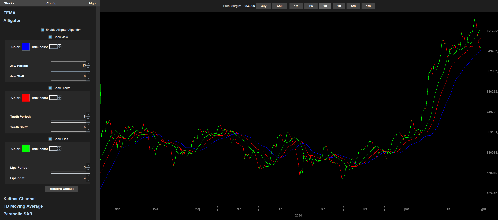

# Chart Project - Financial Data Visualization and Analysis Tool

## Introduction
Chart Project is a complex Java-based application designed for real-time financial data visualization and analysis.
It integrates with the XTB trading platform API to fetch and display market data for currencies, stocks, and other financial instruments.
The application provides users with interactive charts, technical indicators, and tools for market trend analysis.

I developed this project as part of my engineering thesis.
I did not use any third-party charting libraries or API wrappers – everything, both front-end and back-end, was built from scratch.

# Features
- XTB Account Integration – Log in and save client credentials for quick access.
- Market Exploration – Browse available stocks categorized by type.
- Stock Pinning – Mark interesting stocks and access them quickly in a dedicated section.
- Advanced Charting – Open stock charts, switch between different timeframes, and analyze price movements.
- Trading Capabilities – Buy and sell stocks directly from the application.
- Portfolio Management – View account balance and open positions.
- Technical Indicators – Overlay various algorithms on stock charts and customize them.
- Chart Customization – Modify chart appearance and behavior to match user preferences.
- Dynamic Date Axis Scaling – Intelligent resizing of time axes based on zoom level.

<video controls src="chartProject.mp4" title="Showcase"></video>

Note: Communication with XTB api is done by using it's DEMO port, for more information see: [documentation](http://developers.xstore.pro/documentation/)